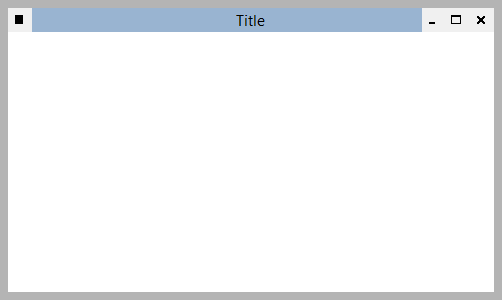

Implements a borderless window using Windows Forms that uses normal controls to preserve the functionality of sizable windows such as:

- Move by dragging the title bar
- Size by dragging the borders and corners
- Maximize, minimize, and close buttons
- System menu
- Double click title bar to maximize
- Aero snap

The window decoration controls in the example are simple labels and can be changed to provide a custom look.

